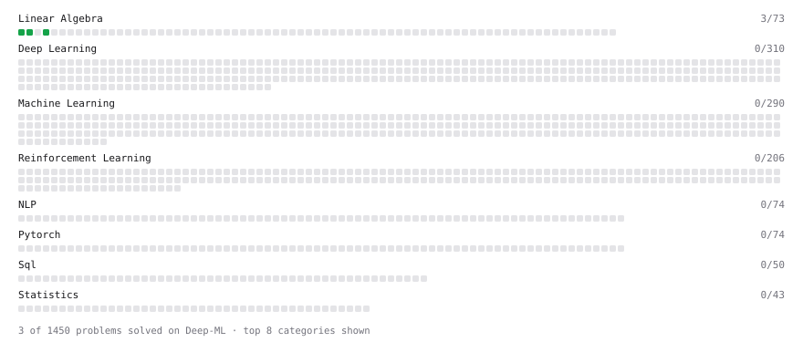

# Deep-ML

My machine learning practice from [Deep-ML](https://www.deep-ml.com). Every solution here was written by hand.

**4** solved · 4 problems · 0 labs · 0 math

[**Browse the interactive portfolio**](https://olmurphy.github.io/deep-ml/) to replay this filling in over time.

## Problems

| | Difficulty | Solved | |
| --- | --- | --- | --- |
| [Calculate Mean by Row or Column](https://www.deep-ml.com/problems/4) | easy | 2026-09-26 | [solution](problems/0004-calculate-mean-by-row-or-column) |
| [Matrix-Vector Dot Product](https://www.deep-ml.com/problems/1) | easy | 2026-09-26 | [solution](problems/0001-matrix-vector-dot-product) |
| [Transpose of a Matrix](https://www.deep-ml.com/problems/2) | easy | 2026-09-26 | [solution](problems/0002-transpose-of-a-matrix) |
| [Matrix times Matrix ](https://www.deep-ml.com/problems/9) | medium | 2026-10-01 | [solution](problems/0009-matrix-times-matrix) |

---

_This file is regenerated by Deep-ML on every push._
